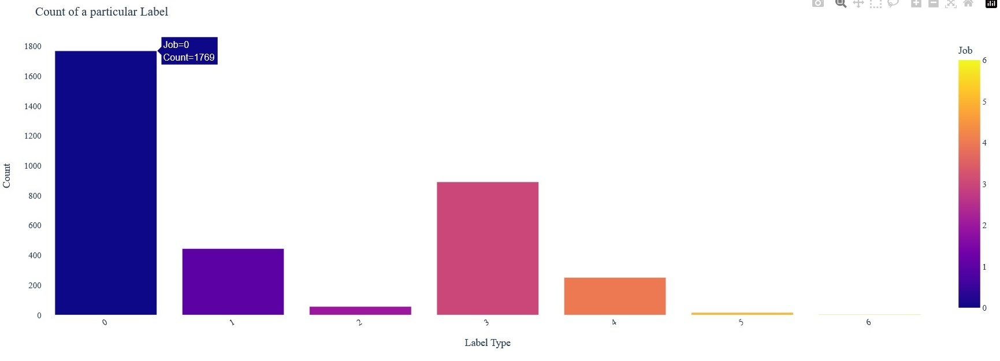

# resum-AI-zer

After the description in Russian, below is a full description in English...

В данном проекте предпринята попытка создать некий нейросетевой инструмент для автоматического анализа резюме.
Проект входит в набор бизнес-кейсов для учебы и практики от [VK Education](https://education.vk.company/education_projects).

#### Краткое описание: "Ваша задача — разработать нейросеть, которая будет помогать кандидатам составить продающее резюме. Научите модель анализировать ключевые ошибки и предлагать рекомендации. Помогите тысячам молодых специалистов быстро и эффективно устроиться на работу".
Что было сделано в рамках проекта:
1. Найден [архив](https://github.com/florex/resume_corpus) с несколькими десятками тысяч резюме **ИТ-специалистов** (все резюме представлены на английском языке).
2. Архив содержит набор файлов резюме с расширением ".txt" с соответствующим списком меток в файле с расширением .lab.
3. Данный набор текстовых файлов и меток классов был преобразован в единый CSV-файл со столбцами: 'Category' (специальность соискателя) и 'Resume' (сам текст резюме).
4. Далее, после изучения информации о составлении резюме и о типичных ошибках, для решения задачи автоматического анализа и классификации резюме были придуманы следующие семь меток (классов):
    - **Класс 0**: резюме составлено правильно и корректно с точки зрения работодателя, особых замечаний нет
    - **Класс 1**: недостаточно полно указаны технические навыки, опыт и достижения
    - **Класс 2**: нет (или мало) информации о предыдущих местах работы
    - **Класс 3**: недостаточно подробно перечислены основные технологии и инструменты, с которыми умеет работать автор резюме
    - **Класс 4**: недостаточно информации про образование, в том числе и про дополнительное (онлайн курсы, повышение квалификации, полученные сертификаты и так далее)
    - **Класс 5**: резюме недостаточно краткое и лаконичное
    - **Класс 6**: нет информации о готовности к постоянному обучению и развитию (саморазвитию), о готовности работать в команде, об аналитических навыках и так далее.
 
5. Для разметки исходного набора данных с резюме в соответствии с классами, описанными выше, был использован ChatGPT API (о1), в результате получен CSV-файл со столбцами: 'Category' (специальность соискателя), 'Resume' (текст резюме) и 'Label' (метка класса от 0 до 6). 
6. Для работы с датасетом была выбрана нейросетевая модель-трансформер [BERT](https://github.com/google-research/bert), но сразу же выявилось ограничение: "The BERT model can process texts of the maximal length of 512 tokens (roughly speaking tokens are equivalent to words)".
7. Поэтому были исследованы другие решения, например [BELT](https://github.com/mim-solutions/bert_for_longer_texts) (BERT For Longer Texts) и [ModernBERT](https://huggingface.co/blog/modernbert), данные решения позволяют обойти ограничение в 512 токенов.

### Содержание репозитория
В репозитории 4 ноутбука:
- **Prepare_resume_dataset.ipynb** - в данном ноутбуке мы готовим датасет для дальнейшей работы.
- **Analyze_dataset_with_resume.ipynb** - анализируем полученный выше датасет на сбалансированность классов, строим различные графики и т.п.
- **BELT.ipynb** - ноутбук подготовлен на основе примеров из репозитория [BELT](https://github.com/mim-solutions/bert_for_longer_texts). В данном ноутбуке  мы дообучаем BELT на нашем датасете и получаем accuracy в районе **0.64**.
- **ModernBERT.ipynb** - ноутбук подготовлен на основе статьи [ModernBERT — A modernized BERT for NLP tasks](https://unfoldai.com/modernbert/) и примеров из репозитория [ModernBERT](https://unfoldai.com/modernbert/). В данном ноутбуке  мы дообучаем ModernBERT на нашем датасете и получаем accuracy в районе **0.63**.
- **resumaizer.py** - [телеграм-бот](https://t.me/HappyClients_bot), который ожидает от пользователя резюме (в формате pdf), а в ответ выдает несколько рекомендаций по улучшению данного резюме. Телеграм-бот - это **интерфейс для взаимодействия с внешними пользователями**. Мой бот размещён на хостинге [railway.com](railway.com).

### Примечание
Полученная невысокая точность модели (0,64), как мне кажется, обусловлена невысоким качеством исходного датасета. В датасете присутствует несбалансированность классов: данных, относящихся к классам 0 и 3 существенно больше, чем в остальных классах.

## Project description in English
The topic of the project is to develop a neural network that will help candidates create a selling resume. We are trying to teach the model to analyze key errors and offer recommendations.

The project is part of a set of business cases for study and practice from [VK Education](https://education.vk.company/education_projects).

#### Brief description: "Your task is to develop a neural network that will help candidates create a selling resume. Teach the model to analyze key errors and offer recommendations. Help thousands of young professionals quickly and effectively find a job."
What was done within the project:
1. An [archive](https://github.com/florex/resume_corpus) with several tens of thousands of resumes of IT specialists was found.
2. The archive contains a set of resume files with the extension ".txt" with a corresponding list of tags in a file with the extension .lab.
3. This archive was converted to a CSV file with the columns: 'Category' (job seeker's specialty) and 'Resume' (the text of the resume itself).
4. Further, to solve the problem of automatic analysis of resumes, the following seven labels (classes) were invented for classifying resumes:
    - **Class 0**: the resume is composed correctly and appropriately from the employer’s point of view, there are no special comments
    - **Class 1**: technical skills, experience and achievements are not fully specified
    - **Class 2**: no (or little) information about previous places of work
    - **Class 3**: the main technologies and tools that the resume author is able to work with are not listed in sufficient detail
    - **Class 4**: not enough information about education, including additional education (online courses, advanced training, received certificates, etc.)
    - **Class 5**: the resume is not short and concise enough
    - **Class 6**: no information about readiness for continuous learning and development (self-development), readiness to work in a team, analytical skills, etc.
5. ChatGPT was used to classify the dataset with resumes, resulting in a CSV file with the following columns: 'Category' (job seeker's specialty), 'Resume' (resume text) and 'Label' (class label from 0 to 6).
6. The [BERT](https://github.com/google-research/bert) neural network model was chosen to work with the dataset, but a limitation was immediately revealed: "The BERT model can process texts of the maximal length of 512 tokens (roughly speaking tokens are equivalent to words)".
7. Therefore, other solutions were explored, such as [BELT](https://github.com/mim-solutions/bert_for_longer_texts) (BERT For Longer Texts) and [ModernBERT](https://huggingface.co/blog/modernbert), these solutions allow to bypass the 512 token limit.

### Repository Contents
The repository contains 4 notebooks:
- **Prepare_resume_dataset.ipynb** - in this notebook we prepare the dataset for further work.
- **Analyze_dataset_with_resume.ipynb** - we analyze the dataset obtained above for class balance, build various graphs, etc.
- **BELT.ipynb** - the notebook is prepared based on examples from the [BELT](https://github.com/mim-solutions/bert_for_longer_texts) repository. In this notebook, we further train BELT on our dataset and obtain accuracy in the region of **0.64**.
- **ModernBERT.ipynb** - the notebook is prepared based on the article [ModernBERT — A modernized BERT for NLP tasks](https://unfoldai.com/modernbert/) and examples from the [ModernBERT](https://unfoldai.com/modernbert/) repository. In this notebook, we further train ModernBERT on our dataset and obtain accuracy in the region of **0.63**.
- **resumaizer.py** - a telegram bot that waits for a resume (in pdf format) from the user and in response gives several recommendations on how to improve this resume. The telegram bot is an **interface for interacting with external users**.